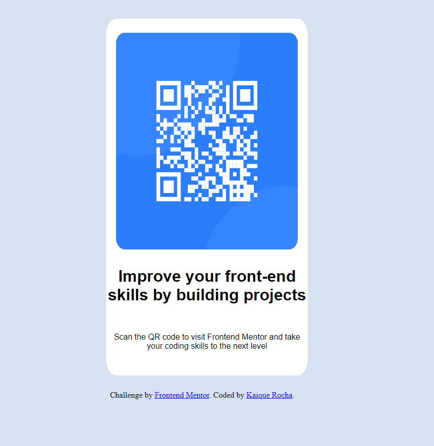

# Frontend Mentor - Solução para o desafio do componente de código QR

Esta é uma solução para o [desafio do componente de código QR no Frontend Mentor](https://www.frontendmentor.io/challenges/qr-code-component-iux_sIO_H). Os desafios do Frontend Mentor ajudam você a aprimorar suas habilidades de codificação, construindo projetos realistas.

## Índice

- [Visão Geral](#visão-geral)
  - [Captura de Tela](#captura-de-tela)
  - [Links](#links)
- [Autor](#autor)

## Visão Geral

O projeto que desenvolvi é uma aplicação simples de código QR, focada em praticar conceitos fundamentais de HTML e CSS, com especial atenção à responsividade utilizando as media queries `@media`. O objetivo principal foi criar uma solução visualmente atraente e funcional que se adapte a diferentes dispositivos e tamanhos de tela.

### Captura de Tela

### Links

- **URL da Solução:** ([Qr Code Challenge Solution](https://www.frontendmentor.io/solutions/solution-challenge-qr-code-with-responsive-landing-eC_IMdH_XJ))
- **URL do Site Ao Vivo:** ([Qr Code Challenge Online](https://kaique-rocha.github.io/QrCode-Challenge-FrontendMentor/))

#### Implementação Responsiva

Ao longo do desenvolvimento, concentrei-me em garantir uma experiência de usuário consistente em vários dispositivos, desde telas grandes de desktop até dispositivos móveis. Utilizei media queries para ajustar o layout, fontes e outros estilos para garantir a legibilidade e usabilidade em todas as plataformas.

#### Estilização com CSS Personalizado

A estilização foi feita principalmente através de CSS customizado, utilizando propriedades personalizadas e abordagens modulares. Isso não apenas melhorou a legibilidade do código, mas também permitiu uma fácil manutenção e ajuste de estilos conforme necessário.

#### Próximos Passos

Embora tenha focado em conceitos básicos de HTML e CSS neste projeto, planejo expandir e aprimorar as funcionalidades no futuro. Estou sempre buscando maneiras de melhorar minhas habilidades e explorar novas tecnologias.

Espero que esta aplicação simples demonstre meu comprometimento com boas práticas de codificação e design responsivo.

## Autor

- Site - ([Kaique Rocha](https://www.seu-site.com](https://github.com/Kaique-Rocha))
- - Frontend Mentor - ([Kaique Rocha](https://www.frontendmentor.io/profile/seuusuario))
- Linkedin - ([Kaique Rocha](https://www.linkedin.com/in/kaique-rocha-0bab132ab/))

